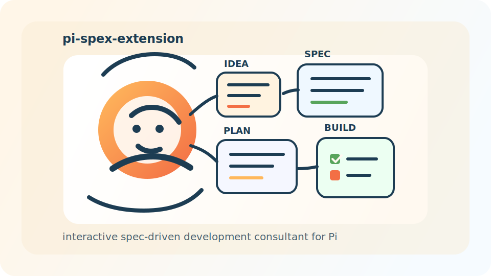

<p align="center">
  
</p>

<p align="center">
  <strong>Spec-driven development workflows for Pi, with spex-style guidance, gating, review, and an interactive consultant.</strong>
</p>

<p align="center">
  <a href="https://github.com/trotsky1997/pi-spex-extension"></a>
  
  
  
</p>

# pi-spex-extension

`pi-spex-extension` is a Pi package that combines:

- Spec Kit's `/speckit.*` workflow for specification-driven development
- spex-inspired workflow helpers for review, drift reconciliation, and staged delivery
- an interactive consultant skill that interviews the user and recommends the right next SDD step

It is designed to help users move from vague intent to explicit specification, planning, task breakdown, implementation, review, and final readiness checks inside Pi.

## What it provides

### Runtime commands

- `/spex-init`
- `/spex-traits`
- `/spex-help`
- `/spex-worktree`
- `/spex-team`
- `/spex-ship`

`spex-ship` also supports:

- `status`
- `cleanup`
- `--resume`
- `--start-from <stage>`
- `--ask <always|smart|never>`

### Prompt-based workflow helpers

- `/spex-brainstorm`
- `/spex-review-spec`
- `/spex-review-plan`
- `/spex-review-code`
- `/spex-evolve`
- `/spex-stamp`

`/spex-team` supports:

- `plan`
- `implement`
- `wrapup`

### Interactive consultant skill

- `/skill:spec-driven-development-consultant`

Use the consultant when the user is unsure how to apply Spec-Driven Development in the current repository. It diagnoses repo state, uses `AskUserQuestion` when needed, and steers the user toward the correct `/spex-*` or `/speckit.*` next step.

## Install

### From GitHub

Install into the current project:

```bash
pi install -l git:github.com/trotsky1997/pi-spex-extension@v0.1.0
pi install -l git:github.com/trotsky1997/pi-claude-code-ask-user
```

Install globally:

```bash
pi install git:github.com/trotsky1997/pi-spex-extension@v0.1.0
pi install git:github.com/trotsky1997/pi-claude-code-ask-user
```

Track the latest main branch instead of a tag:

```bash
pi install -l git:github.com/trotsky1997/pi-spex-extension@main
```

### From a local checkout

```bash
pi install -l /home/aka/pi-playground/pi-spex-extension
pi install -l /home/aka/pi-playground/pi-claude-code-ask-user
```

Quick-load without installing:

```bash
pi -e /home/aka/pi-playground/pi-spex-extension/extensions/spex/index.ts
```

To use the teammate-oriented workflow helpers, also load the companion `pi-claude-subagent` extension:

```bash
pi -e /home/aka/pi-playground/pi-spex-extension/extensions/spex/index.ts \
   -e /home/aka/pi-playground/pi-claude-subagent/extensions/claude-subagent/index.ts
```

If you also want shared teammate task orchestration, load `pi-claude-todo-v2` too:

```bash
pi -e /home/aka/pi-playground/pi-spex-extension/extensions/spex/index.ts \
   -e /home/aka/pi-playground/pi-claude-subagent/extensions/claude-subagent/index.ts \
   -e /home/aka/pi-playground/pi-claude-todo-v2/extensions/claude-todo-v2/index.ts
```

`pi-spex-extension` does not auto-bundle `AskUserQuestion`. Install `pi-claude-code-ask-user` alongside it when you want interactive `/spex-init`, `/spex-traits interactive`, or consultant flows that ask structured questions.

## Prerequisite

Install Spec Kit's `specify` CLI first:

```bash
uv tool install specify-cli --from git+https://github.com/github/spec-kit.git
```

`/spex-init` reuses the existing `AskUserQuestion` tool from `pi-claude-code-ask-user` for interactive trait and permission selection.

If you already installed `pi-claude-code-ask-user` separately, that is the correct setup. `pi-spex-extension` no longer tries to register a second bundled copy, so the `AskUserQuestion` tool will not conflict.

## Typical flow

1. Run `/spex-init`
2. Run `/reload` if the new `/speckit.*` prompts are not visible yet
3. Optionally enable traits with `/spex-traits enable superpowers`
4. Use `/speckit.constitution`, `/speckit.specify`, `/speckit.plan`, `/speckit.tasks`, `/speckit.implement`
5. Use `/spex-review-spec`, `/spex-review-plan`, `/spex-review-code`, `/spex-evolve`, and `/spex-stamp` around the core flow
6. If the `teams` trait is enabled and `pi-claude-subagent` is loaded, use `/spex-team plan` or `/spex-team implement` to kick off teammate-based planning research or implementation
7. Use `/spex-team wrapup` to collect teammate/task-list state and hand off into review, verification, or cleanup
8. Use `/spex-ship` for the stateful end-to-end pipeline when `superpowers` and `deep-review` are enabled

## Traits

Supported v1 traits:

- `superpowers`
- `deep-review`
- `teams`
- `worktrees`

Trait state is stored in:

- `.specify/spex-traits.json`

The extension injects hidden turn context for Spec Kit / spex work based on enabled traits. It does not patch `.claude/skills` or rewrite upstream prompt files.

## Canonical artifacts used by `/spex-ship`

Core stage outputs:

- `spec.md`
- `clarify.md`
- `plan.md`
- `tasks.md`
- `implementation.md`
- `verification.md`

Later review outputs:

- `review-spec.md`
- `review-plan.md`
- `review-code.md`
- `stamp.md`

The ship pipeline validates these artifacts before advancing. Review artifacts require structured metadata, not just headings.

Examples:

- `review-spec.md`
  - `Verdict: approved|revise|required-clarification`
  - `Finding Count: <number>`
  - `Residual Risks: none|<summary>`
- `review-plan.md`
  - `Coverage Status: full|partial|insufficient`
  - `Finding Count: <number>`
  - `Residual Risks: none|<summary>`
- `review-code.md`
  - `Compliance Score: <number>%`
  - `Finding Count: <number>`
  - `Residual Risks: none|<summary>`

## Notes

- The `teams` trait is a companion workflow for `pi-claude-subagent`. It does not bundle team tools itself; it guides the agent to use `TeamCreate`, `Agent`, `SendMessage`, and `TeamDelete` when that package is loaded.
- If `pi-claude-todo-v2` is also loaded, `/spex-team implement` can create and assign shared workstreams through `TaskCreate`, `TaskGet`, `TaskList`, `TaskUpdate`, and `TaskStop`, and `/spex-team wrapup` can use the same task list for completion and review handoff.
- `/spex-ship` is an extension-backed stateful pipeline command. It persists `.specify/.spex-ship-phase.json` and manages lifecycle through `spex_ship_state`.
- `spex_ship_state advance` performs stage-aware artifact validation before allowing the pipeline to move forward.
- `/spex-ship --resume` distinguishes running, paused, failed, and completed pipelines, emits recovery instructions, and restores paused pipelines to `running` before resuming the current stage.

## Citation

If you use `pi-spex-extension` in research, teaching materials, or technical writing, please cite it.

### BibTeX

```bibtex
@software{zhang_2026_pi_spex_extension,
  author       = {Di Zhang},
  title        = {pi-spex-extension},
  year         = {2026},
  url          = {https://github.com/trotsky1997/pi-spex-extension},
  version      = {0.1.0},
  license      = {MIT}
}
```

Machine-readable citation metadata is also available in `CITATION.cff`.

## License

MIT. See `LICENSE`.
